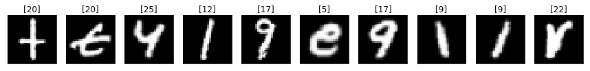
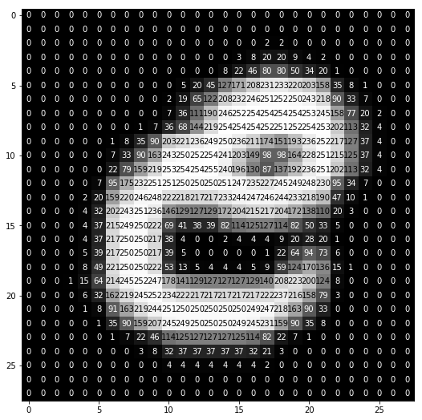

### [UPDATE]: I will not be responding to issues or emails related to this repo anymore as I am currently occupied with other research commitments. Also, the libraries used are pretty old and outdated. Thank you.

# Alphabet Recognition Through Gestures [](https://github.com/akshaychandra21/Alphabet_Recognition_RealTime/blob/master/LICENSE.txt)

This deep learning application in python recognizes alphabet through gestures captured real time on a webcam. The user is allowed to write the alphabet on the screen using an object-of-interest (a water bottle cap in this case).

## Working Example


## Code Requirements
The code is in Python (version 3.6 or higher). You also need to install OpenCV and Keras (2.1.4 version) libraries.

## Data Description
A popular demonstration of the capability of deep learning techniques is object recognition in image data.

The "Extended Hello World" of object recognition for machine learning and deep learning is the [EMNIST dataset](https://www.kaggle.com/crawford/emnist) for handwritten letters recognition. It is an extended version of the [MNIST](https://en.wikipedia.org/wiki/MNIST_database) dataset.

A set of sample images is shown below.



Each of the letters is stored as a numbered array as shown below.



I built a Multilayer Perceptron (MLP) model as well as a Convolutional Neural Network (CNN) model using [Keras](https://keras.io/) library. The predictions of both the models are shown on the screen in real time.

The Test accuracies were as follows:

* MLP Test Accuracy: 91.7%
* CNN Test Accuracy: 93.1%

For both the models, I actually used the exact same architectures I implemented in the [Digits Recognition](https://github.com/akshaychandra111/Digits_Recognition_RealTime) project (for obvious 'extended' reasons).

## Code Explanation
I have written [a tutorial post on medium](https://medium.com/@akshaychandra21/97e697b8fb86) explaining the code.

## Execution
Order of Execution is as follows:

Step 1 - Execute ``` python mlp_model_builder.py ```

Step 2 - Execute ``` python cnn_model_builder.py ```

Step 3 - This could take a while, so feel free to take a quick nap.

Step 4 - Execute ``` python alphabet_recognition.py ```

Step 5 - Grab a blue bottle cap and have fun!
